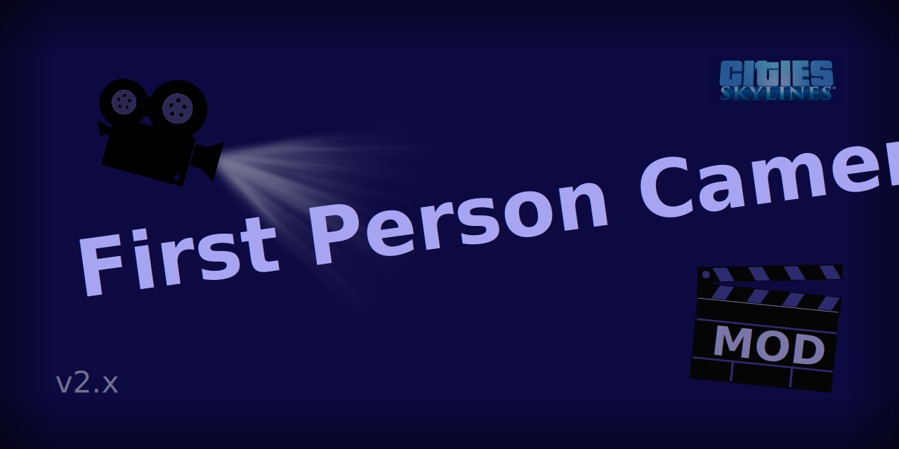
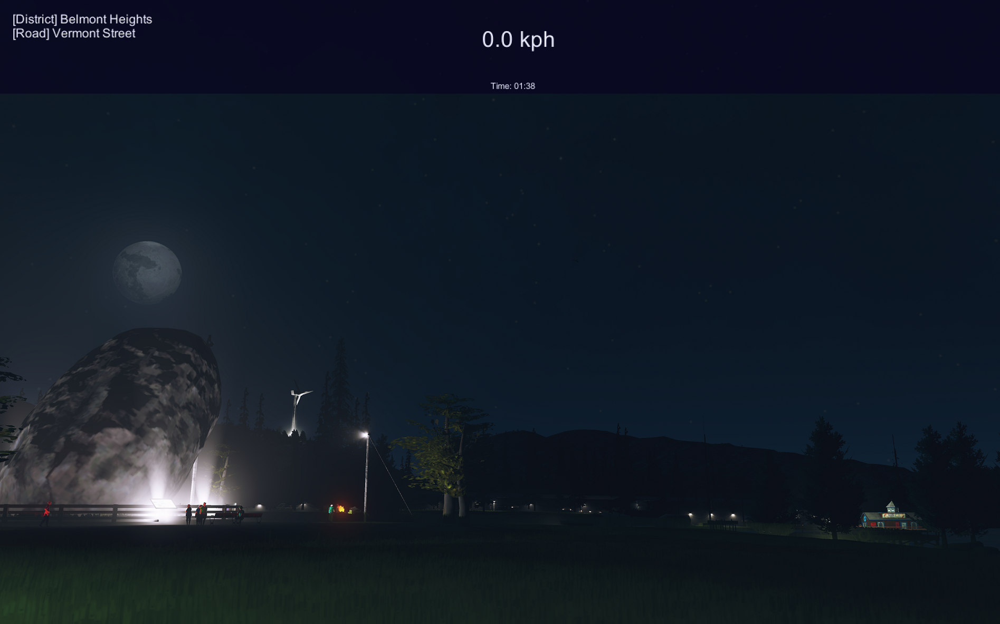
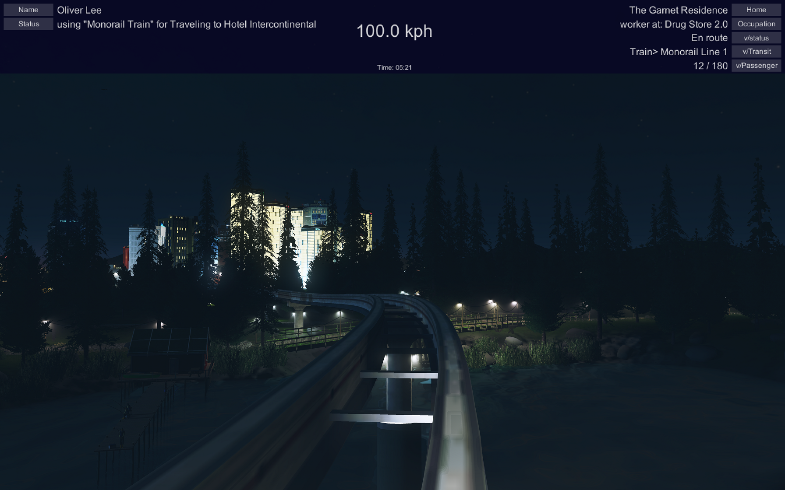

# Cities: Skylines - First Person Camera Mod v2.1

> This is an updated version for [First Person Camera: Updated](https://steamcommunity.com/sharedfiles/filedetails/?id=650805785) by tony56a

[First Person Camera](https://github.com/Asu4ni/CitiesSkylines-FPSCamera) is a lightweight mod that attaches an extra **Camera Controller** to the original [Cities: Skylines](https://www.citiesskylines.com) game to enable users to view their cities in first person perspective.

Refer to the [wiki](https://github.com/Asu4ni/CitiesSkylines-FPSCamera/wiki) page for instructions and guide on how to use the mode as well as how to contribute to the development.

---
> The mod can also be downloaded on [Steam Workshop](https://steamcommunity.com/sharedfiles/filedetails/?id=2764243667).

